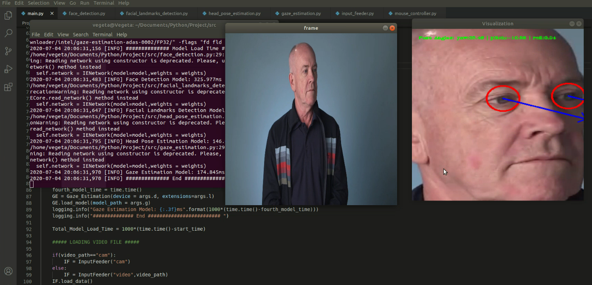
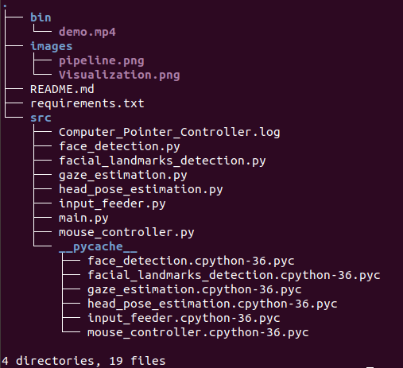

# Computer Pointer Controller

## Introduction
Computer Pointer Controller app is used to control the movement of mouse pointer by the direction of eyes and also estimated pose of head. This app takes video as input(video file or camera) and then estimate the gaze of the user's eyes and change the mouse pointer position accordingly. 

## Project Set Up and Installation
#### Install Intel® Distribution of OpenVINO™ toolkit

Refer to this [guide](https://docs.openvinotoolkit.org/latest/) for installing OpenVINO.

#### Initialize the OpenVINO environment

- For Linux, open terminal
```
source /opt/intel/openvino/bin/setupvars.sh
```
- For Windows, open command prompt as Admin
```
cd C:\Program Files (x86)\IntelSWTools\openvino\bin\
```
```
setupvars.bat
```


#### Install pre-trained models

After successfully installing OpenVINO toolkit, we need to install the models required for our project. In this project we require 4 models:-

- [Face Detection Model](https://docs.openvinotoolkit.org/latest/_models_intel_face_detection_adas_binary_0001_description_face_detection_adas_binary_0001.html)
- [Face Landmarks Detection Model](https://docs.openvinotoolkit.org/latest/_models_intel_landmarks_regression_retail_0009_description_landmarks_regression_retail_0009.html)
- [Head Pose Estimation Model](https://docs.openvinotoolkit.org/latest/_models_intel_head_pose_estimation_adas_0001_description_head_pose_estimation_adas_0001.html)
- [Gaze Estimation](https://docs.openvinotoolkit.org/latest/_models_intel_gaze_estimation_adas_0002_description_gaze_estimation_adas_0002.html)

#### Pipeline

You will have to coordinate the flow of data from the input, and then amongst the different models and finally to the mouse controller. The flow of data will look like this:


#### Downloading Models

**For Linux**

- face-detection-adas-binary-0001
```
sudo /opt/intel/openvino/deployment_tools/tools/model_downloader/downloader.py --name face-detection-adas-binary-0001
```
- landmarks-regression-retail-0009
```
sudo /opt/intel/openvino/deployment_tools/tools/model_downloader/downloader.py --name landmarks-regression-retail-0009
```
- head-pose-estimation-adas-0001
```
sudo /opt/intel/openvino/deployment_tools/tools/model_downloader/downloader.py --name head-pose-estimation-adas-0001
```
- gaze-estimation-adas-0002
```
sudo /opt/intel/openvino/deployment_tools/tools/model_downloader/downloader.py --name gaze-estimation-adas-0002
```

**For Windows**

- face-detection-adas-binary-0001
```
python "C:/Program Files (x86)/IntelSWTools/openvino/deployment_tools/tools/model_downloader/downloader.py" --name "face-detection-adas-binary-0001"
```
- landmarks-regression-retail-0009
```
python "C:/Program Files (x86)/IntelSWTools/openvin/deployment_tools/tools/model_downloader/downloader.py" --name "landmarks-regression-retail-0009"
```
- head-pose-estimation-adas-0001
```
python "C:/Program Files (x86)/IntelSWTools/openvino/deployment_tools/tools/model_downloader/downloader.py" --name "head-pose-estimation-adas-0001"
```
- gaze-estimation-adas-0002
```
python "C:/Program Files (x86)/IntelSWTools/openvino/deployment_tools/tools/model_downloader/downloader.py" --name "gaze-estimation-adas-0002"
```
#### Clone the Repository

```
git clone https://github.com/suryaprabhakar414/Computer-Pointer-Controller-OpenVINO
```
#### Install the requirements
```
cd Computer-Pointer-Controller-OpenVINO
```
```
pip install -r requirements.txt
```

#### Create a Virtual Environment

**For Windows**

```
virtualenv Virtual_Env
```

**For Linux**

```
python -m venv Virtual_Env
```

#### Activate the Virtual Environment

**For Windows**
```
Virtual_Env\Scripts\activate
```
**For Linux**
```
source Virtual_Env/bin/activate
```

## Running the Application

- CPU
```
python <path to main.py> -f <path to face detection directory> -fl <path to landmarks regression retail directory> -hp <path to head pose estimation directory> -g <path to gaze estimation directory> -i <path to input video> -d CPU
```
- GPU
```
python <path to main.py> -f <path to face detection directory> -fl <path to landmarks regression retail directory> -hp <path to head pose estimation directory> -g <path to gaze estimation directory> -i <path to input video> -d GPU
```
- FPGA
```
python <path to main.py> -f <path to face detection directory> -fl <path to landmarks regression retail directory> -hp <path to head pose estimation directory> -g <path to gaze estimation directory> -i <path to input video> -d HETERO:FPGA,CPU
```
- VPU (NCS2)
```
python <path to main.py> -f <path to face detection directory> -fl <path to landmarks regression retail directory> -hp <path to head pose estimation directory> -g <path to gaze estimation directory> -i <path to input video> -d MYRIAD 
```
## Demo

```
python3 main.py -f "/opt/intel/openvino_2020.2.120/deployment_tools/tools/model_downloader/intel/face-detection-adas-binary-0001/FP32-INT1/" -fl "/opt/intel/openvino_2020.2.120/deployment_tools/tools/model_downloader/intel/landmarks-regression-retail-0009/FP32/" -hp "/opt/intel/openvino_2020.2.120/deployment_tools/tools/model_downloader/intel/head-pose-estimation-adas-0001/FP32/" -g "/opt/intel/openvino_2020.2.120/deployment_tools/tools/model_downloader/intel/gaze-estimation-adas-0002/FP32/" -i  "/home/vegeta/Documents/Python/Project/bin/demo.mp4" -d CPU -flags "fd fld hp ge"
```



## Documentation

### Command Line Arguments

-  -h, --help    show this help message and exit
-  -i(required): Specify Path to video file or enter cam for webcam
-  -f(required): Specify Path to folder(.xml and .bin) of Face Detection model.
-  -fl(required): Specify Path to folder(.xml and .bin) of Facial Landmark Detection model.
                
-  -hp(required): Specify Path to folder(.xml and .bin) of Head Pose Estimation model.
                
-  -g(required): Specify Path to folder(.xml and .bin) of Gaze Estimation model.
                
-  -flags(optional):  Specify the flags from fd, fld, hp, ge like --flags fd hp fld (Seperate each flag by space) for see the visualization of different model outputs of each frame, fd for Face Detection, fld for Facial Landmark Detection hp for Head Pose Estimation, ge for Gaze Estimation.

-  -prob(optional): Probability threshold for model to detect the face accurately from the video frame.

-  -d(optional): Specify the target device to infer on: CPU, GPU, FPGA or MYRIAD is acceptable. Sample will look for a suitable plugin for device specified (CPU by default).
-  -l(optional): MKLDNN (CPU)-targeted custom layers. Absolute path to a shared library with the kernels impl.

-  -it(optional): Inference type, sync for Synchronous or async for Asychronous

### Directory Structure



src folder contains the following files:- 
- [face_detection.py](./src/face_detection.py):- 
  - Performs preprocessing and inference on the input frame.  
  - Returns the face coordinates and the face image.
- [face_landmarks_detection.py](./src/face_landmarks_detection.py)
  - Performs preprocessing and inference on the face image.
  - Returns the left eye image, right eye image and eye coordinates.
- [gaze_estimation.py](./src/gaze_estimation.py)
  - Takes the left eye image, right eye image, head pose angles as input.
  - Performs preprocessing ans inference.
  - Returns the mouse coordinates and gaze vector.
- [head_pose_estimation.py](./src/head_pose_estimation.py)
  - Performs preprocessing and inference on the face image.
  - Returns head pose angles(yaw, pitch, roll).
- [input_feeder.py](.src/input_feeder.py)
  - Contains InputFeeder class which initialize VideoCapture as per the user argument.
  - Returns the frames one by one.
- [main.py](./src/main.py)
  - Contains the main script to run the application.
- [mouse_controller.py](.src/mouse_controller.py)
  - Contains MouseController class which take x, y coordinates value, speed, precisions and according these values it moves the mouse pointer by using pyautogui library.
  
  


## Benchmarks

My laptop has **Intel(R) Core(TM) i5-9300H CPU @ 2.40GHz 2.40 GHz** processor

### Synchronous Inference

#### FP32


| Model | Type | Load Time | Inference Time |
|------|---|---| --- |
| face-detection-adas-binary-0001 |FP32-INT1| 280.731ms | 34.636ms|
| landmarks-regression-retail-0009 |FP32|135.403ms |  1.722ms| 
| head-pose-estimation-adas-0001 |FP32 |233.368ms | 3.510ms |
| gaze-estimation-adas-0002 |FP32| 139.832ms | 4.696ms |

- Total Model Load Time: 790.420ms
- Total Inference Time: 28.839s 
- FPS:2.2183605509514606 

#### FP16

| Model | Type | Load Time | Inference Time |
|------|---|---| --- |
| face-detection-adas-binary-0001 |FP32-INT1|202.636ms | 30.853ms|
| landmarks-regression-retail-0009 |FP16|182.331ms | 1.618ms| 
| head-pose-estimation-adas-0001 |FP16 |409.070ms | 2.689ms |
| gaze-estimation-adas-0002 |FP16| 495.434ms| 3.333ms |

- Total Model Load Time: 1290.419ms
- Total Inference Time: 27.472s
- FPS:2.3244733164082003

#### FP16-INT8

| Model | Type | Load Time | Inference Time |
|------|---|---| --- |
| face-detection-adas-binary-0001 |FP32-INT1| 300.426ms | 33.491ms|
| landmarks-regression-retail-0009 |FP16-INT8|132.802ms |  1.700ms| 
| head-pose-estimation-adas-0001 |FP16-INT8 |177.418ms| 3.450ms |
| gaze-estimation-adas-0002 |FP16-INT8| 231.592ms |4.364ms|

- Total Model Load Time: 843.230ms
- Total Inference Time: 26.750s
- FPS:2.331284085631999

### Asynchronous Inference

#### FP32
| Model | Type | Load Time | Inference Time |
|------|---|---| --- |
| face-detection-adas-binary-0001 |FP32-INT1|216.242ms | 20.996ms|
| landmarks-regression-retail-0009 |FP32|114.711ms|  0.946ms| 
| head-pose-estimation-adas-0001 |FP32 |201.458ms | 2.716ms |
| gaze-estimation-adas-0002 |FP32| 212.321ms | 2.941ms|

- Total Model Load Time: 746.801ms
- Total Inference Time: 25.853s
- FPS:2.428872194112504


#### FP16

| Model | Type | Load Time | Inference Time |
|------|---|---| --- |
| face-detection-adas-binary-0001 |FP32-INT1| 192.765ms | 18.180ms|
| landmarks-regression-retail-0009 |FP16-INT8|152.837ms|  1.215ms| 
| head-pose-estimation-adas-0001 |FP16-INT8 |379.143ms| 1.624ms |
| gaze-estimation-adas-0002 |FP16-INT8| 461.904ms |1.854ms|

- Total Model Load Time: 1187.753ms
- Total Inference Time: 24.190s
- FPS:2.4572291786726423

#### FP16-INT8

| Model | Type | Load Time | Inference Time |
|------|---|---| --- |
| face-detection-adas-binary-0001 |FP32-INT1|210.464ms| 16.713ms|
| landmarks-regression-retail-0009 |FP16|114.007ms | 0.842ms| 
| head-pose-estimation-adas-0001 |FP16 |122.805ms | 1.939ms |
| gaze-estimation-adas-0002 |FP16| 158.406ms| 2.497ms |

- Total Model Load Time: 606.968ms
- Total Inference Time: 23.867s
- FPS:2.5548579128862854


## Results

- For face-detection-adas-binary-0001 model only FP32-INT1 was available. 
- For landmarks-regression-retail-0009, head-pose-estimation-adas-0001 and head-pose-estimation-adas-0001  FP32, FP16-INT8 and FP16 was available.
- Lowering the model precision from FP32 to FP16 or FP16-INT8 reduced the inference inference time, because low precision will occupy less space and requires less computation power, hence it is faster.  
- Lowering model precision affects the accuracy of the model, because as we reduce the model precision we lose some important information which causes reduction in accuracy.
- It can be observed clearly from the above tables, the inference time of FP32 is greater than that of FP16 and FP16-INT8, because as we increase the model precision the model becomes more complex and requires more computation power, hence resulting in an increase in inference time.
 

## Stand Out Suggestions

### Video and Webcam feed

- The user can upload a video file or can use the webcam by specifying the option in the command line arguments. 
- For using the webcam the user has to specify "cam" in the command line arguments. 
- For using a video file the user has to specify the path to video file in the command line arguments.

### Async Inference
- I have used Asynchronous Inference in this project.
- The user can specify the type of inference ("sync" or "async") in the command line arguments.
- As we can observe from the above tables, the inference time for all models in each precision is reduced while running in asynchronous mode, because in asynchronous mode if the respose for a particular request takes a long time, then the system doesn't hold up, rather it continues with the next process while the current process is executing.
- We use the "wait" process to wait for the inference result to be available.
- Asynchronous does not block the main thread like synchronous.So, we could have a frame sent for inference, while still gathering and pre-processing the next frame.

### Edge Cases

- In case of multiple faces, the model takes the first detected face to control the mouse pointer, hence ignoring all ther other faces. 
- Lighting changes are important, because the model cannot detect the gaze properly if proper lighting is not present


